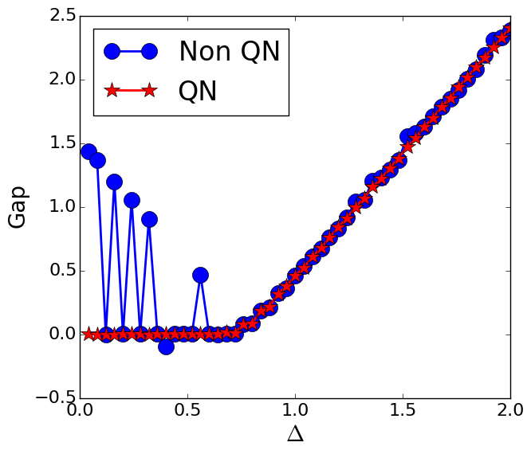
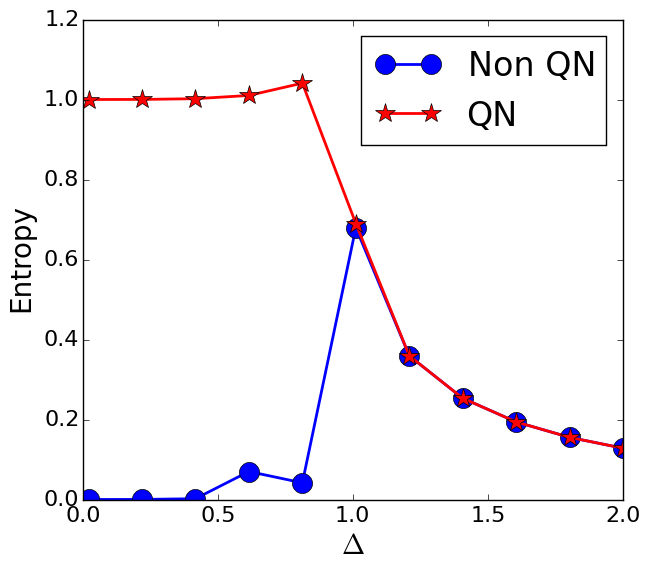

Spin model with Parity conservation

Benoît Vermersch&mdash;2016

##Model
We are interested in the ground state properties of the long-range Ising model
\begin{equation}
H = \sum_{i<j} \frac{J}{(j-i)^3} \sigma_i^x \sigma_j^x +\sum_i \Delta \sigma_i^z, 
\end{equation}
as realized for instance in trapped ion experiments.

Using the standard DMRG approach (without Quantum numbers), the ground state search thus becomes  more and more challenging as  $\Delta\to0$ because the energy gap vanishes.
In particular, it becomes extremely challenging to calculate accurately the entropy of the ground state entropy, a small admixture of the first excited state in the estimated ground state leading to significant errors in the entropy.

This problem can be cured using the fact that the Hamiltonian conserves the parity of the number of excitations and that ground and first excited states have opposite parity. 
(For two particles, these state correspond respectively to $\ket{\uparrow}\ket{\uparrow}-\ket{\downarrow}\ket{\downarrow}$, $\ket{\uparrow}\ket{\downarrow}-\ket{\downarrow}\ket{\uparrow}$).
Using a MPS ansatz with Quantum numbers associated to the parity conservation, the DMRG search will be thus in this case unaffected by the gap closing at $\Delta\to 0$.

##Implementation of the site set
To implement parity conservation with ITensor, we create a new spin set spinhalfparity.h, which is based on spinhalf.h with the crucial differences that the indices describe the number of excitations modulo 2, i.e the parity. This file has to be placed in the folder itensor/mps/sites.

    inline void SpinHalf::
    constructSites()
     {
     for(int j = 1; j <= N_; ++j)
            {
             site_.at(j) = IQIndex(nameint("S=1/2 ",j),
                Index(nameint("Up ",j),1,Site),QN({1,2}),
                Index(nameint("Dn ",j),1,Site),QN({0,2}));
            }
      }

Given that the SxSx operator conserves the parity, we cam also comment the line  "Op = mixedIQTensor(s,sP);" of the original spinhalf.h class.

    if(opname == "Sx")
        {
        //mixedIQTensor call needed here
        //because as an IQTensor, Op would
        //not have a well defined QN flux
        //Op = mixedIQTensor(s,sP);
        Op.set(Up,DnP,+0.5);
        Op.set(Dn,UpP,+0.5);
        }

##Illustration of the performance of the QN approach

In our code, we now load the new site set

    #include "itensor/mps/sites/spinhalfparity.h"
    #include "itensor/all.h"

and write our Hamilonian MPO using the autompo module of ITensor:

        //Long range ising model
        auto ampo = AutoMPO(sites);
        for(int j = 1; j <= N; ++j)
        {
                ampo += 2.*Delta,"Sz",j;
                for(int k = 1; k <= ncut; ++k)
                        if (j+k<=N)
                                ampo += 4*J*std::pow(k,-alpha),"Sx",j,"Sx",j+k;
        }
        // MPO CONSTRUCTION WITHOUT QN
        auto H = MPO(ampo);
        // MPO WITH QN
        auto HQ = IQMPO(ampo);

We finally use the dmrg algorithm to compare the efficiency of the parity non-conserving and parity conserving implementations of the MPOs.

        //Eigenstate search for non-conserving QN MPO
        Real penalty = 20;
        auto psi = MPS(sites);
        auto en = dmrg(psi,H,sweeps,{"Quiet=",true});
        auto w = std::vector<MPS>(1);
        w.at(0) = psi;
        auto psi1 = MPS(sites);
        auto en1 = dmrg(psi1,H,w,sweeps,{"Quiet=",true,"Weight=",penalty});

        //Eigenstate search conserving QN MPO
        InitState state(sites,"Up");  // Search in the even parity sector
        auto phi = IQMPS(state);
        auto enP = dmrg(phi,HQ,sweeps,{"Quiet=",true});
        state.set(1,"Dn");  // Search in the odd parity sector
        auto phi1 = IQMPS(state);
        auto enP1 = dmrg(phi1,HQ,sweeps,{"Quiet=",true});

     
 The gap and the fidelities as a function of the detuning $\Delta$  and for $N=40$ sites are represented in the Figure below showing the advantage of the Quantum number approach.
 
 

 

 
 
<a href="parityQN.zip">Download the full codes and the python scripts used to create and plot the data</a>

